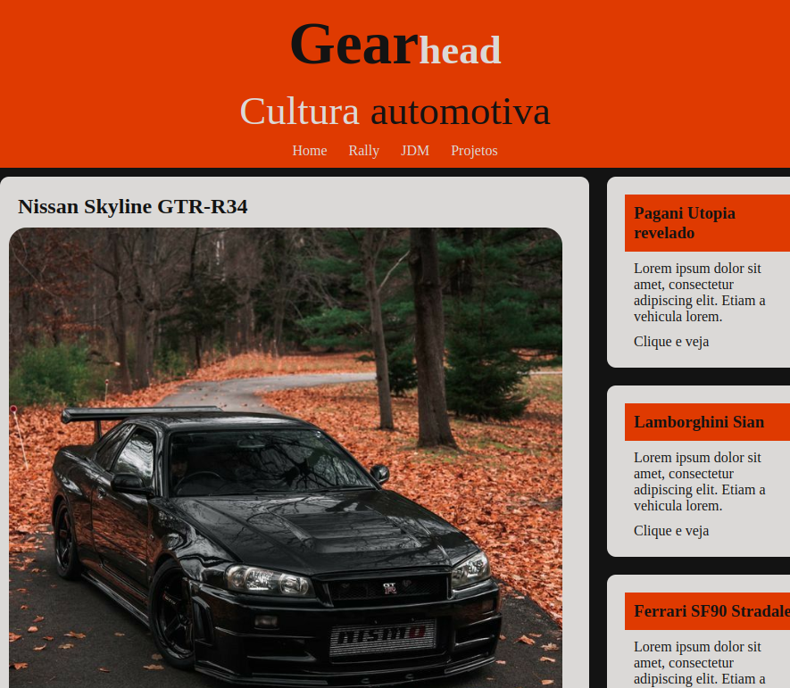

# Desenvolvimento web Full Stack

> Curso Desenvolvimento Web Full Stack

Projeto construído baseado nas aulas do meu curso de desenvolvedor full stack da Udemy.
Criei esta página estática de um blog automotivo fictício para testar meus conhecimentos de HTML e CSS.

obs: Imagens dos carros tirada do Pinterest!

[🔗Clique aqui para acessar](https://vitoredusantos.github.io/gearhead-car-blog/)

# 🛠Tecnologias

-HTML
-CSS
-Git e Github

# 💛Contato

E-mail:
vitore.santos@hotmail.com

Linkedin
https://www.linkedin.com/in/vitor-santos-078071219/
